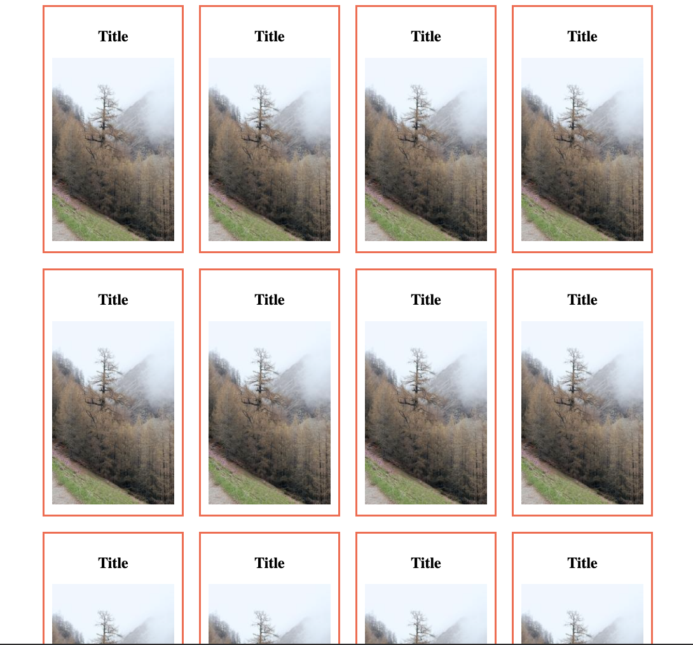

# Automatic grid

Create a grid with images like shown in the example.

1. the grid should have a variable number of columns depending on the window size (use auto-fit or auto-fill)
1. for the image, use a url like this: https://picsum.photos/200/300

BONUS: make the grid container 960px and centered, but that adapts if the window gets smaller

